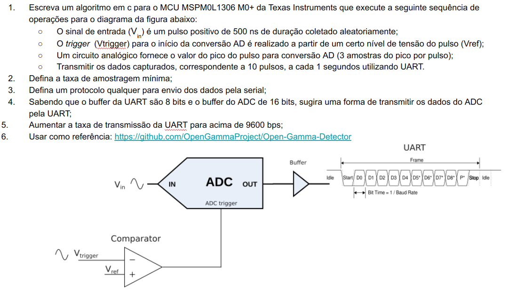

# ADC to UART Project for MSPM0L1306

## Overview

This project demonstrates how to read analog data using the ADC12 module on the MSPM0L1306 microcontroller and transmit the converted digital values over UART. The project is built using TI's MSPM0 SDK and is compiled with the TI ARM Clang compiler.

## Project Structure

├── adc_to_uart_LP_MSPM0L1306_nortos_ticlang
│ ├── adc_to_uart.c
│ ├── device.opt
│ ├── Debug
│ ├── README.md
│ └── .project

## Hardware Requirements

- TI LaunchPad MSPM0L1306
- UART-to-USB converter
- Analog input source (e.g., a potentiometer)

## Software Requirements

- Code Composer Studio (CCS) v10 or later
- MSPM0 SDK v2.01.00.03 or later

## UART Configuration

The project sets up UART communication with the following parameters:

- Baud Rate: 115200
- Data Bits: 8
- Parity: None
- Stop Bits: 1

### Baud Rate Calculations

For a UART clock frequency of 32 MHz and a desired baud rate of 115200, the Integer and Fractional Baud Rate Divisors (IBRD and FBRD) are calculated as follows:

1. **Integer Baud Rate Divisor (IBRD):**
   \[
   \text{IBRD} = \left\lfloor \frac{32,000,000}{16 \times 115200} \right\rfloor = \left\lfloor \frac{32,000,000}{1,843,200} \right\rfloor = 17
   \]

2. **Fractional Baud Rate Divisor (FBRD):**
   \[
   \text{FBRD} = \left\lfloor \left( \left( \frac{32,000,000}{16 \times 115200} - 17 \right) \times 64 + 0.5 \right) \right\rfloor
   \]
   \[
   \text{FBRD} = \left\lfloor \left( \left( \frac{32,000,000}{1,843,200} - 17 \right) \times 64 + 0.5 \right) \right\rfloor
   \]
   \[
   \text{FBRD} = \left\lfloor (0.361111 \times 64 + 0.5) \right\rfloor = \left\lfloor 23.611104 + 0.5 \right\rfloor = 24
   \]

So, the UART configuration in the code uses `IBRD = 17` and `FBRD = 24`.

## Code Description

### Main Loop

The main loop continuously reads ADC values and transmits them via UART every second.

### Interrupt Service Routine

The ADC interrupt service routine handles the conversion completion and stores the results.

### Functions

- `setupUART()`: Configures UART with the calculated baud rate divisors.
- `setupADC()`: Sets up the ADC to read from a specific channel and configure the sample time.
- `transmitADCResults()`: Transmits the ADC results over UART.
- `delay_ms(uint32_t ms)`: Provides a delay function based on loop iterations.

## How to Build and Run

1. Open the project in Code Composer Studio.
2. Build the project (`Ctrl+B`).
3. Connect the LaunchPad to your PC via USB.
4. Flash the program to the LaunchPad (`F11`).
5. Open a serial terminal on your PC (e.g., PuTTY or Tera Term) and set it to 115200 baud rate.
6. Observe the transmitted ADC values.

## Images

### Block Diagram
+--------------+       +--------------+       +-------------------+       +---------------+
| Analog Input | ----> | ADC12 Module | ----> | MSPM0L1306 Microcontroller | ----> | UART Interface |
+--------------+       +--------------+       +-------------------+       +---------------+

### Circuit Diagram

## License

This project is licensed under the BSD 3-Clause License. See the LICENSE file for details.

## Credits

Developed by [Your Name].

For more information, visit the [TI MSPM0 SDK documentation](https://www.ti.com/tool/MSPM0-SDK).

